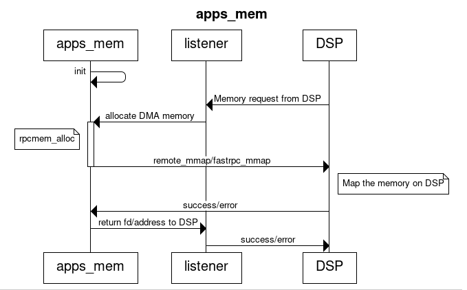
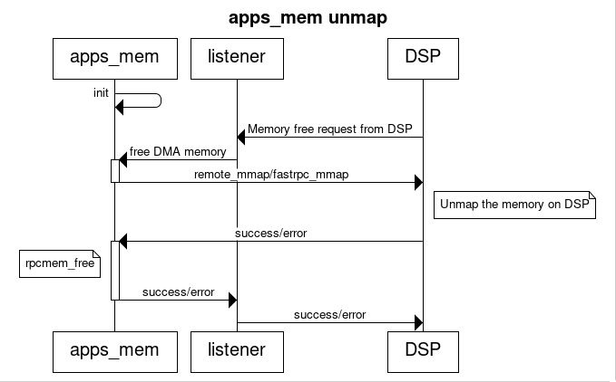

# Design Document for apps_mem

## Overview
apps_mem is an interface specifically designed to execute memory-related operations on APPS from DSP. These operations could include requests for memory allocation and mapping them on SMMU for DSP usage. The requests from DSP could be for either allocating & mapping a buffer or utilizing a file descriptor. Typically, the interface file is designed for communication from APPS to DSP. However, in this unique scenario, this interface file facilitates communication from DSP to APSS.

## Interface Structure
module apps {
   interface mem {
      long request_map(in long heapid, in uint32 ion_flags, in uint32 rflags, in uint32 vin, in int32 len, rout uint32 vapps, rout uint32 vadsp);
      long request_unmap(in uint32 vadsp, in int32 len);
      long request_map64(in long heapid, in uint32 ion_flags, in uint32 rflags, in uint64 vin, in int64 len, rout uint64 vapps, rout uint64 vadsp);
      long request_unmap64(in uint64 vadsp, in int64 len);
      long share_map(in long fd, in long size, rout uint64 vapps, rout uint64 vadsp);
      long share_unmap(in uint64 vadsp, in long size);
   };
};

This interface is compiled using the QAIC compiler. The generated stub/skel files are utilized on APPS and DSP. In this particular case, the generated skel file is linked to the APPS library and the stub is linked to DSP. The implementation file includes the implementation to allocate memory, map them on SMMU, and transmit it to DSP. The behavior of different APIs varies based on their implementation.

## API Structure
```c
int apps_mem_request_map(int heapid, uint32 lflags, uint32 rflags, uint32 vin, int32 len, uint32* vapps, uint32* vadsp);
int apps_mem_request_map64(int heapid, uint32 ion_flags, uint32 rflags, uint64 vin, int64 len, uint64* vapps, uint64* vadsp);
int apps_mem_request_unmap(uint32 vadsp, int32 len);
int apps_mem_request_unmap64(uint64 vadsp, int64 len);
```

The apps_mem_request map and unmap APIs (both 32bit and 64bit) enable DSP to send heapid (ION heap id - in the case of ION heaps), lflags containing flags related to the heap, and rflags containing information related to the remote usage of this memory (for example, the memory is used for remote heap or dynamic loading or it should be a file descriptor or memory should be allocated from LLC). vin contains the virtual address of the memory on APPS, len is the total size of the memory allocated. vapps and vadsp are return values from kernel and DSP, which contains application space virtual address and DSP virtual address.

```c
int apps_mem_share_map(int fd, int size, uint64* vapps, uint64* vadsp);
int apps_mem_share_unmap(uint64 vadsp, int size);
```

The apps_mem_share APIs are an extension to the request APIs described above. These APIs enable DSP to work on file descriptors instead of an address to memory.

```c
int apps_mem_dma_handle_map(int fd, int offset, int size);
int apps_mem_dma_handle_unmap(int fd, int size);
```

The apps_mem_dma_handle APIs are an evolution from apps_mem_share APIs, where there is no need for the virtual address for DSP and APPS, and they completely rely on the file descriptor.

## Remote flags supported
DSP supports five distinct flags, with some overlapping between them. Their primary function is to distinguish how this memory is utilized on the DSP.

### ADSP_MMAP_REMOTE_HEAP_ADDR
This specific flag represents a request for memory by the Audio PD (Specifically) on the DSP for heap operations. When this flag is used, it’s assumed that the memory allocation takes place in the kernel space, not in the user space. The allocated memory is protected at stage 2 using the SMMU, to prevent any other masters from accessing this memory, with the exception of the DSP.

### ADSP_MMAP_HEAP_ADDR
This flag is identical to the previously mentioned one, with the only difference being that it does not provide stage 2 protection at SMMU.

### ADSP_MMAP_ADD_PAGES
ADD_PAGES indicates a memory request by a fastRPC signed/unsigned PD on the DSP for heap operations. Typically, memory is allocated in the user space for unsigned PD, while for signed PD, the allocation takes place in the kernel space.

### ADSP_MMAP_ADD_PAGES_LLC
This flag enables clients to primarily allocate memory from the system’s L3 (LLC) as it offers low latency memory. Additionally, it allows clients to have memory accessible even in low power mode. This option is available only for priviledged applications.

### FASTRPC_ALLOC_HLOS_FD
This flag primarily used in HAP APIs, which are exposed in the Hexagon SDK. Their main function is to allocate memory from the HLOS for different use cases of the clients.

## Application
These APIs are typically used in scenarios where additional memory is required on DSP. For instance, the heap on DSP uses these APIs to bring additional memory from HLOS when the available memory on DSP heap hits a low threshold. In some cases, clients can also use these APIs to bring memory for their use case, but with the latest implementation, fastrpc_mmap is introduced thereby reducing the usage of these interfaces.

## Sequence diagram

### Map



### Unmap


