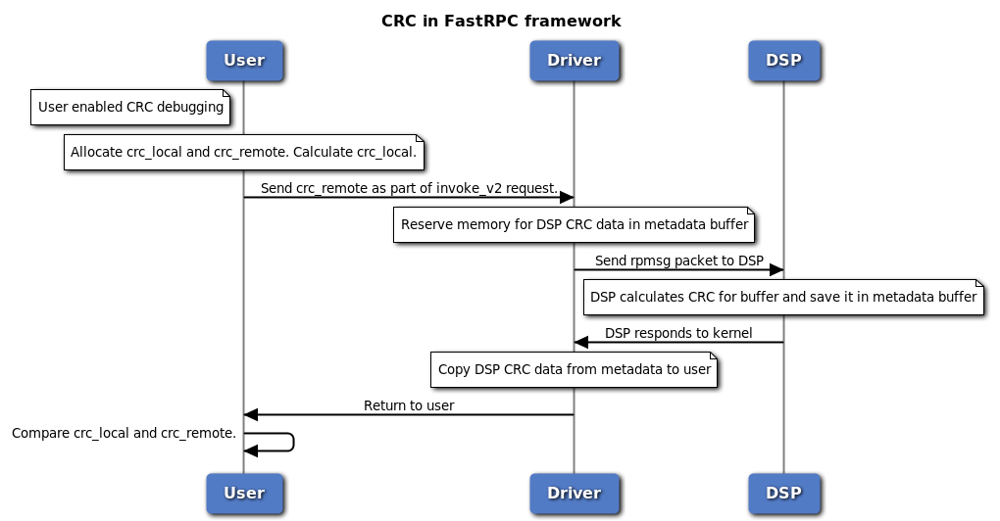
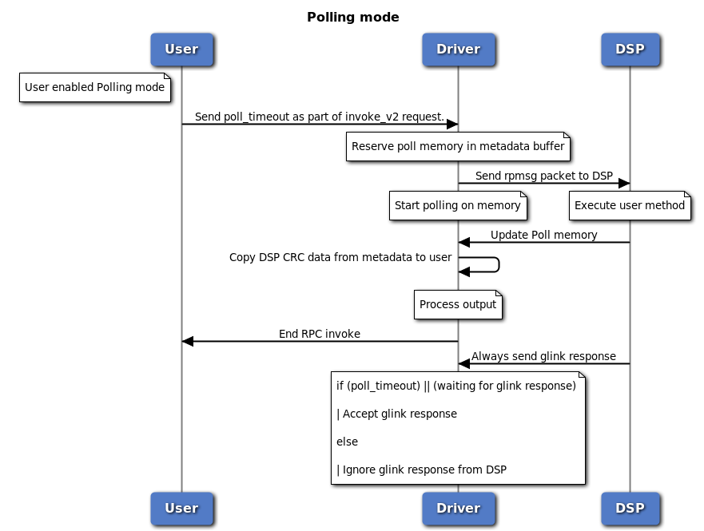
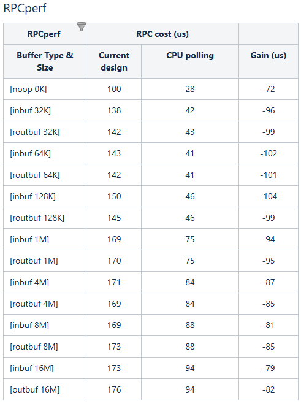

# Document for invoke_v2

## 1. Introduction
This document provides details about the enhanced invocation invoke_v2 request.

## 2. IOCTL interface
**IOCTL Name**: FASTRPC_IOCTL_INVOKEV2  
**Description**: Any enhanced invocation request like CRC, perf counters, polling mode etc. will be made using this ioctl.


## 3. Data Structures

```c
struct fastrpc_ioctl_invoke_v2 {
	struct fastrpc_ioctl_invoke inv; /* Invocation struct carrying handle, sc and arg details */
	__u64 crc; /* User CRC memory pointer where DSP CRC values will be copied by fastrpc driver */
	__u64 poll_timeout; /* Time for which driver will poll on memory */
	__u32 reserved[14]; /* Reserved space for future enhancements */
};
```

## 4. CRC
CRC is a debugging feature which can be enabled by users to check for data inconsistencies in remote buffers. If user intends to enable CRC check, first local user CRC is calculated at user end and a CRC buffer is passed to DSP to capture remote CRC values. DSP is expected to write to the remote CRC buffer which is then compared at user level with the local CRC values.

Steps to enable CRC:
export FASTRPC_PROCESS_ATTRS=4



In case CRC is not supported on DSP, it won't result in any fatal failures. Only warning is getting printed for CRC mismatches.

## 5. Polling mode
For any remote call to DSP, after sending an invocation message, fastRPC driver waits for glink response and during this time the CPU can go into low power modes. Adding a polling mode support with which fastRPC driver will poll continuously on a memory after sending a message to remote subsystem which will eliminate CPU wakeup and scheduling latencies and reduce fastRPC overhead. With this change, DSP always sends a glink response which will get ignored if polling mode didn't time out.

Steps to enable polling mode:

** Remote control structure **:
```c
typedef enum remote_rpc_latency_flags {
  RPC_DISABLE_QOS = 0,
  RPC_PM_QOS,
  RPC_ADAPTIVE_QOS,
  RPC_POLL_QOS,
} remote_rpc_control_latency_t;
 
struct remote_rpc_control_latency {
  remote_rpc_control_latency_t enable;
  uint32_t latency;  // Pass expected method execution time on DSP
};
```

** Application code **:
```c
struct remote_rpc_control_latency data;
data.enable = RPC_POLL_QOS;
data.latency = 5000;  // Expected 5 ms execution time on DSP
err = remote_handle64_control(h, DSPRPC_CONTROL_LATENCY, (void*)&data, sizeof(data));
```


** Performance comparision **

