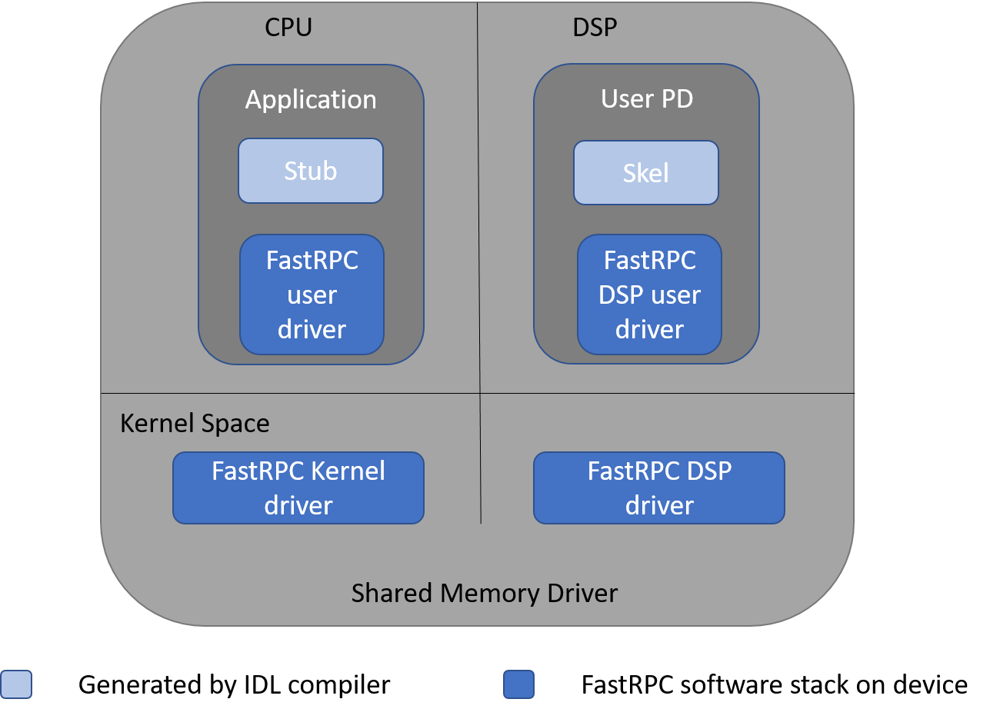
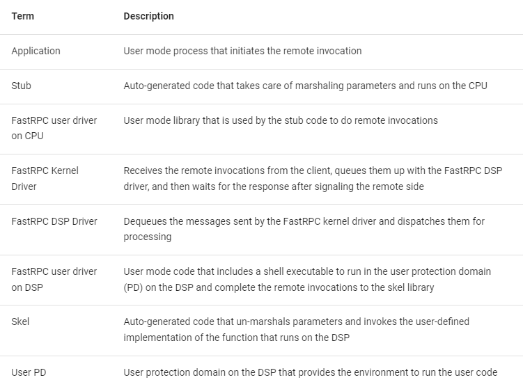
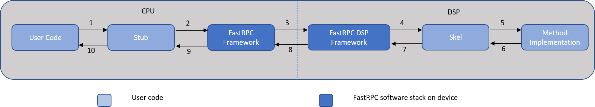

# FastRPC

## Introduction

A Remote Procedure Call (RPC) allows a computer program calling a procedure to execute in another remote processor, while hiding the details of the remote interaction. FastRPC is the RPC mechanism used to enable remote function calls between the CPU and DSP.

Customers with algorithms that benefit from being executed on the DSP can use the FastRPC framework to offload large processing tasks onto the DSP. The DSP can then leverage its internal processing resources, such as HVX, to execute the tasks in a more compute- and power-efficient way than the CPU.

FastRPC interfaces are defined in an IDL file, and they are compiled using the QAIC compiler to generate header files and stub and skel code. The header files and stub should be built and linked into the CPU executable while the header files and skel should be built and linked into the DSP library.

### FastRPC Architecture

The following diagram depicts the major FastRPC software components on the CPU and DSP.



**Stub and skel** are generated by the IDL compiler. Other modules are part of the software stack on the device.

**Definition of the terms in the diagram:**



### FastRPC Workflow

The FastRPC framework consists of the following components.



**Workflow:**

1. The CPU process calls the stub version of the function. The stub code converts the function call to an RPC message.
2. The stub code internally invokes the FastRPC framework on the CPU to queue the converted message.
3. The FastRPC framework on the CPU sends the queued message to the FastRPC DSP framework on the DSP.
4. The FastRPC DSP framework on the DSP dispatches the call to the relevant skeleton code.
5. The skeleton code un-marshals the parameters and calls the method implementation.
6. The skeleton code waits for the implementation to finish processing, and, in turn, marshals the return value and any other output arguments into the return message.
7. The skeleton code calls the FastRPC DSP framework to queue the return message to be transmitted to the CPU.
8. The FastRPC DSP framework on the DSP sends the return message back to the FastRPC framework on the CPU.
9. The FastRPC framework identifies the waiting stub code and dispatches the return value.
10. The stub code un-marshals the return message and sends it to the calling User mode process.

## Features Supported

Hexagon SDK documentation covers all the required details about FastRPC. Please download and install the Hexagon SDK from the following location:
[Hexagon SDK](https://developer.qualcomm.com/software/hexagon-dsp-sdk)

## Build & Installation

### Steps to Generate Native Binaries on Device

```bash
git clone https://github.com/quic/fastrpc
cd fastrpc
./gitcompile
sudo make install
```

### Steps to cross-compile the project on Ubuntu

1. **Install the cross compiler and dependencies:**

    ```bash
    sudo apt install g++-aarch64-linux-gnu binutils-aarch64-linux-gnu
    ```

2. **Create softlink files for the compiler, linker, and other tools. Create environment variables as below for the auto tools:**

    ```bash
    export CC=aarch64-linux-gnu-gcc
    export CXX=aarch64-linux-gnu-g++
    export AS=aarch64-linux-gnu-as
    export LD=aarch64-linux-gnu-ld
    export RANLIB=aarch64-linux-gnu-ranlib
    export STRIP=aarch64-linux-gnu-strip
    ```

3. **Sync and compile using the below command:**

    ```bash
    git clone https://github.com/quic/fastrpc
    cd fastrpc
    ./gitcompile --host=aarch64-linux-gnu
    ```

### Steps to Generate Android Binaries on Ubuntu Build Machine

1. **Download Android NDK from [here](https://developer.android.com/ndk/downloads/index.html), and set up the `ANDROID_NDK_HOME` environment variable as mentioned. Add the tools bin location to the path:**

    ```bash
    export ANDROID_NDK_HOME="/usr/home/android_ndk"
    export PATH="$PATH:$ANDROID_NDK_HOME/toolchain/bin"
    ```

2. **Create softlink files for the compiler, linker, and other tools. Create environment variables as below for the auto tools:**

    ```bash
    export CC=aarch64-linux-android34-clang
    export CXX=aarch64-linux-android34-clang++
    export AS=llvm-as
    export LD=ld
    export RANLIB=llvm-ranlib
    export STRIP=llvm-strip
    ```

3. **Sync and compile using the below command:**

    ```bash
    git clone https://github.com/quic/fastrpc
    cd fastrpc
    ./gitcompile --host=aarch64-linux-android
    ```

## Testing

For detailed instructions on testing FastRPC, please refer to the [README.md](test/README.md) in the `test` directory.

## Logging Control and Verbosity

Both VERIFY and FARF are logging mechanisms used in fastRPC. While VERIFY is a legacy module, FARF is commonly utilized on both DSP (Digital Signal Processor) and HLOS (High-Level Operating System).

### Verify Logging Macros

- `VERIFY_IPRINTF(format, ...)`: This macro is enabled by `VERIFY_PRINT_INFO` and is used for debug logs.
- `VERIFY_EPRINTF(format, ...)`: Enabled by `VERIFY_PRINT_ERROR`, this macro is used for error logs.
- `VERIFY_WPRINTF(format, ...)`: This macro is enabled by `VERIFY_PRINT_WARN` and is used for warnings.
- `VERIFY_EPRINTF_ALWAYS(format, ...)`: This macro does not require any enabling macros and is used for logs that should always be printed.

**Example:**

```c
#include "verify.h"
#define VERIFY_PRINT_ERROR

VERIFY_EPRINTF("Error: Operation failed with result %d\n", result);
```

### Farf Logging

The FARF API is a macro used to print debug logs. It allows developers to selectively enable or disable certain types of messages based on their priority level. The priority levels include LOW, MEDIUM, HIGH, ERROR, FATAL, and ALWAYS.

**Key Points:**

- **Usage:** FARF is used similarly to the `printf` function, where the first parameter is the level of the message, and the rest are the message contents.
- **Levels:** The FARF levels allow users to control the verbosity of the logs. For example, setting a FARF level to 1 enables the corresponding FARF macros to be compiled in.
- **Runtime FARF:** Runtime FARF messages are prefixed with "RUNTIME_" and can be enabled or disabled at runtime. These messages are always compiled in but can be controlled during execution.
- **Implementation:** To use FARF, the header file `HAP_farf.h` needs to be included in the build. This inclusion is typically sufficient to enable FARF.

**Example Code:**

```c
#define FARF_LOW 1
#include "HAP_farf.h"

FARF(LOW, "LOW message");
FARF(HIGH, "HIGH message"); // This message will not be compiled in
```

### Log Files

- **adsprpcd.farf:** This file is used to configure the FARF logging levels. You can specify which levels of logs should be enabled.
- **adsprpcd.debugconfig:** This file can be used to configure additional debug settings.

### Logging from DSP

Logs from the DSP can be obtained using the logging mechanisms described above. When userspace and kernel logs indicate that an error is received from the DSP, you can use the FARF and VERIFY macros to capture and analyze the logs for troubleshooting.

## Bug Reporting Guidelines

When reporting bugs, please provide the following details to facilitate debugging:

- **Platform/SoC Name:** Specify the name of the platform or System on Chip (SoC) being used.
- **User Space Library Version/HLOS Build Details:** Include the version of the user space library and details of the High-Level Operating System (HLOS) build.
- **Kernel Version:** Provide the version of the kernel.
- **stdout & stderr for User Space:** Share the standard output and standard error logs for the user space.
- **dmesg Logs:** Include the dmesg logs.
- **User Library Logs:** Can be captured from /var/log/syslog
- **QXDM/mini-dm Logs:** Provide QXDM or mini-dm logs. Note that the Hexagon SDK includes mini-dm for collecting logs from the DSP.
- **Tests Run & Parameters:** Detail the tests that were run along with their parameters, including any environment variables explicitly set for FastRPC.
- **Custom Test Code:** If a custom test was conducted, please share a code snippet or the complete code to reproduce the issue.
- **Performance Logs:** For performance-related issues, provide performance logs enabled by setting specific environment variables. The following environment variables can be used:
  - `export FASTRPC_PERF_KERNEL=1`
  - `export FASTRPC_PERF_ADSP=1`
  - `export FASTRPC_PERF_FREQ=1`
- **ftrace Logs:** Include ftrace logs for performance issues.

## Resources

- Hexagon SDK documentation: [Hexagon SDK](https://developer.qualcomm.com/software/hexagon-dsp-sdk)
- Linaro documentation: [Testing FastRPC](https://git.codelinaro.org/linaro/qcomlt/fastrpc/-/wikis/Testing-FastRPC)

## Contributions

Thanks for your interest in contributing to FastRPC! Please read our [Contributions Page](CONTRIBUTING.md) for more information on contributing features or bug fixes. We look forward to your participation!

## License

FastRPC is licensed under the BSD 3-clause "New" or "Revised" License. Check out the [LICENSE](LICENSE.txt) for more details.
